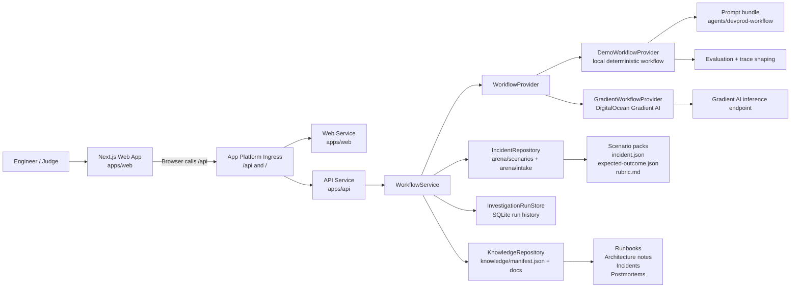

# DevProd

DevProd is an AI-powered incident-response control plane for software teams. It helps engineers investigate incidents, correlate recent changes, retrieve runbooks and prior incidents, rank root-cause hypotheses, recommend remediation, and draft postmortems through a bounded multi-agent workflow.

This repository is the DigitalOcean Gradient AI Hackathon submission for DevProd.

## Hackathon Status

DevProd is runnable locally and includes:

- a Next.js dashboard
- a FastAPI backend
- seeded incident scenarios
- a retrieval corpus of runbooks, architecture notes, and incidents
- a prompt bundle for specialized workflow agents
- evaluation and benchmark artifacts
- DigitalOcean App Platform deployment configuration

The live public deployment was not completed before the submission deadline. The app is intended to be deployed with DigitalOcean App Platform and DigitalOcean Gradient AI, and the deployment spec is included in [`.do/app.yaml`](./.do/app.yaml).

## What DevProd Does

Given an incident, DevProd can:

1. classify the issue and investigation path
2. collect structured evidence
3. correlate likely causal changes
4. retrieve relevant operational knowledge
5. rank root-cause hypotheses
6. recommend remediation steps
7. draft a postmortem
8. expose a reviewable workflow trace

## Why DigitalOcean Gradient AI

DevProd is designed around DigitalOcean Gradient AI as the hosted AI layer for:

- agent orchestration
- inference
- knowledge-backed retrieval
- evaluation and traces
- production deployment paths for AI workflows

This submission includes both:

- a demo provider for local development and hackathon review
- a live-provider integration path in the backend for DigitalOcean Gradient AI

## Repository Structure

- [`apps/web`](./apps/web): Next.js dashboard
- [`apps/api`](./apps/api): FastAPI orchestration service
- [`agents/devprod-workflow`](./agents/devprod-workflow): workflow prompt bundle
- [`arena/scenarios`](./arena/scenarios): benchmark incident scenarios
- [`knowledge`](./knowledge): runbooks, architecture notes, incidents, and postmortems
- [`evals`](./evals): evaluation helpers and benchmark runner
- [`packages/contracts`](./packages/contracts): shared API contracts and schemas
- [`.do/app.yaml`](./.do/app.yaml): DigitalOcean App Platform spec

## Architecture



## Current Features

- Incident inbox and investigation dashboard
- Structured investigation runs over seeded incidents
- Retrieval-backed evidence and knowledge surfacing
- Ranked hypotheses and remediation suggestions
- Postmortem drafting
- Reviewable workflow traces
- Benchmark scenarios with expected outcomes and rubrics

## Local Setup

### Prerequisites

- Node.js 20+
- Python 3.11+
- npm

### Environment

Create a local `.env` from [`.env.example`](./.env.example).

For local demo mode, the important values are:

```bash
APP_BASE_URL=http://localhost:3000
API_BASE_URL=http://localhost:8000
INTERNAL_API_BASE_URL=http://localhost:8000
NEXT_PUBLIC_API_BASE_URL=http://localhost:8000
DEMO_MODE=true
DEVPROD_ENABLE_AUTH=false
```

### Install

Web dependencies:

```bash
npm install
```

API dependencies:

```bash
cd apps/api
python -m venv .venv
.venv\Scripts\pip install -e .[dev]
```

### Run Locally

From the repository root:

```bash
npm run dev:api
```

In a second terminal:

```bash
npm run dev:web
```

Or run the containerized local stack:

```bash
npm run dev
```

### Tests

Web:

```bash
npm test
npm run typecheck
```

API:

```bash
cd apps/api
.venv\Scripts\python.exe -m pytest tests\test_api.py tests\test_evaluation.py tests\test_providers.py
```

## Deployment

The repository includes a DigitalOcean App Platform spec in [`.do/app.yaml`](./.do/app.yaml) for:

- `web`: Next.js frontend
- `api`: FastAPI backend

The intended production topology is:

- DigitalOcean App Platform for the web and API services
- DigitalOcean Gradient AI for live AI-backed workflow execution

For the hackathon submission, local demo mode is the primary supported path.

## Demo Scenarios

The seeded arena currently includes:

- deployment breaks auth flow
- queue workers fail after dependency upgrade
- latency spike after cache config change

These scenarios are paired with retrieval documents, expected outcomes, and scoring rubrics so the workflow can be reviewed and benchmarked.

## Submission Note

This project is submitted as a new application built for the DigitalOcean Gradient AI Hackathon. The public repository contains the full source code, local run instructions, benchmark artifacts, and deployment configuration needed to evaluate the project.

## License

This project is licensed under the MIT License. See [LICENSE](./LICENSE).
