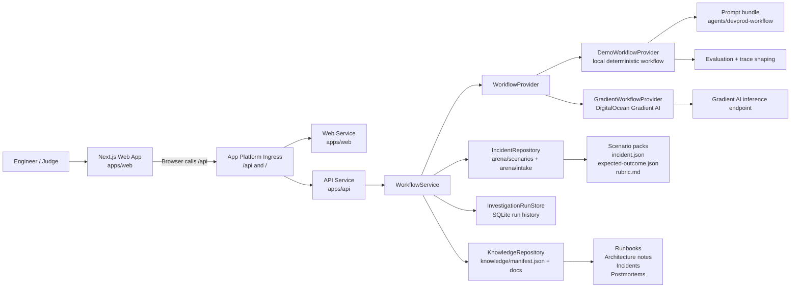
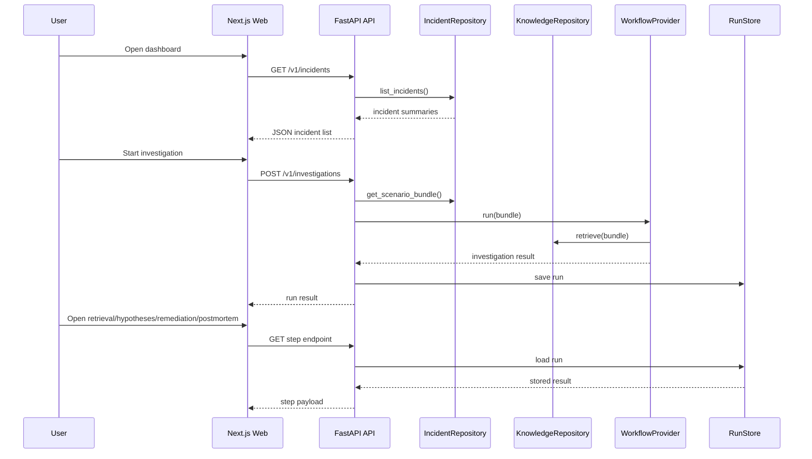

## Architecture

DevProd is a two-service application with a seeded incident arena, a retrieval corpus, and a bounded workflow layer that can run either in local demo mode or through a live DigitalOcean Gradient AI provider.

### High-level flow

### Main components

#### Web application

- `apps/web`
- Next.js dashboard for browsing incidents and viewing investigation outputs
- Fetches:
  - `/v1/incidents`
  - `/v1/investigations`
  - `/v1/investigations/{runId}/retrieval`
  - `/v1/investigations/{runId}/hypotheses`
  - `/v1/investigations/{runId}/remediation`
  - `/v1/investigations/{runId}/postmortem`

#### API service

- `apps/api`
- FastAPI service exposing the workflow surface
- Reads runtime configuration from environment variables
- Enforces request controls, auth toggle, and rate limiting
- Persists recent run outputs in SQLite for local/demo review

#### Incident arena

- `arena/scenarios`
- Seeded benchmark cases with:
  - incident metadata
  - alerts and evidence
  - recent correlated changes
  - retrieval context hints
  - expected outcomes
  - grading rubrics

These scenarios let DevProd run repeatable investigations instead of relying on ad hoc prompts alone.

#### Knowledge corpus

- `knowledge`
- Retrieval-friendly operational documents:
  - runbooks
  - architecture notes
  - prior incidents
  - postmortems
- Indexed through `knowledge/manifest.json`

#### Agent bundle

- `agents/devprod-workflow`
- Prompt definitions for:
  - triage
  - evidence
  - retrieval
  - hypothesis
  - remediation
  - postmortem
  - policy review

In demo mode these prompts are treated as the workflow contract and trace surface. In live mode they represent the intended role boundaries for a hosted Gradient-backed workflow.

### Runtime modes

#### Demo mode

When `DEMO_MODE=true`, the API uses the local `DemoWorkflowProvider`.

That provider:

- reads seeded scenario packs
- retrieves matching knowledge documents
- produces structured evidence, hypotheses, remediation, postmortem, and trace output
- makes the full application runnable without external AI dependencies

This is the primary mode used for the hackathon submission.

#### Live mode

When `DEMO_MODE=false`, the API switches to `GradientWorkflowProvider`.

That provider:

- builds a machine-readable investigation prompt
- sends the request to a DigitalOcean Gradient AI endpoint
- validates the returned JSON against the backend response contract

This gives DevProd a path from local benchmarked demo mode to hosted AI-backed execution.

### Request lifecycle

### Why the architecture is structured this way

- The web and API are separated so the system can evolve toward a deployable multi-service application.
- The arena and knowledge corpus live in the repo so the workflow is benchmarkable and reviewable.
- The provider split keeps local hackathon demos reliable while preserving a real integration path for DigitalOcean Gradient AI.
- Shared contracts in `packages/contracts` make the API and UI move together without ad hoc payload drift.
