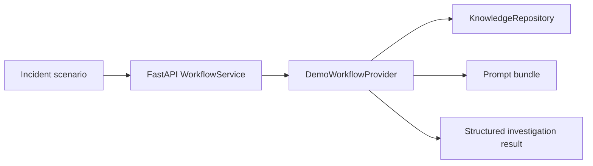
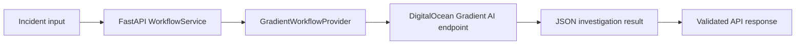

# DigitalOcean Gradient AI Usage

This document explains how DevProd is designed to use DigitalOcean Gradient AI, what is already implemented in the repository, and what remains to complete the live hosted workflow path.

## Where Gradient AI fits in DevProd

DevProd separates the application into three layers:

1. the user-facing control plane
2. the workflow orchestration layer
3. the AI-backed execution layer

DigitalOcean Gradient AI is the intended execution layer for:

- live investigation generation
- hosted inference
- bounded agent workflows
- retrieval-backed responses
- evaluation and trace visibility

## Current implementation in the repo

The backend supports two provider modes:

### 1. Demo provider

Used when:

```bash
DEMO_MODE=true
```

Behavior:

- reads seeded scenario packs from `arena/scenarios`
- reads retrieval documents from `knowledge`
- reads workflow role definitions from `agents/devprod-workflow`
- produces deterministic structured outputs for:
  - evidence
  - changes
  - retrieval results
  - hypotheses
  - remediation
  - postmortem
  - workflow trace

This mode is what makes the project runnable locally without depending on an external AI service.

### 2. Gradient provider

Used when:

```bash
DEMO_MODE=false
```

Behavior:

- serializes the current incident bundle into a machine-readable prompt
- sends the request to a Gradient AI endpoint
- expects JSON output matching the backend investigation contract
- validates the returned payload before surfacing it to the frontend

This provider is implemented in:

- `apps/api/devprod_api/providers.py`

## Environment variables for live mode

To enable the Gradient-backed execution path, the API needs:

```bash
DEMO_MODE=false
GRADIENT_API_BASE_URL=<gradient-endpoint>
GRADIENT_MODEL_ACCESS_KEY=<secret-access-key>
```

Optional related values:

```bash
APP_BASE_URL=<frontend-url>
API_BASE_URL=<api-url>
DEVPROD_ALLOWED_ORIGINS=<frontend-url>
```

## Intended Gradient AI responsibilities

In the full hosted version of DevProd, Gradient AI is intended to power:

- multi-agent orchestration
- model inference for investigation synthesis
- knowledge-backed retrieval
- evaluation and trace capture
- production-facing AI workflow execution

The local repository already includes the surrounding application structure needed for this:

- benchmark scenarios
- retrieval documents
- role-specific workflow prompts
- response contracts
- deployment spec for the web and API services

## Why the project includes a demo path

For hackathon review, reliability matters more than pretending a hosted AI path is already complete.

The demo provider exists so judges can:

- run the project locally
- inspect the workflow structure
- see seeded investigations complete successfully
- evaluate the product concept without external account dependencies

At the same time, the live provider path shows how the application is meant to connect to DigitalOcean Gradient AI in a deployable architecture.

## Example execution model

### Local demo mode



### Intended live mode



## What is implemented vs planned

### Implemented

- backend provider abstraction
- demo workflow provider
- Gradient-backed provider class
- environment-driven mode switching
- structured contracts for returned investigation data
- App Platform deployment spec for web and API services

### Planned next

- complete a public App Platform deployment
- configure a live Gradient endpoint and secret values
- connect retrieval and traces to hosted Gradient-backed workflows
- expand evaluation around live-provider outputs

## Submission note

For the hackathon submission, DevProd demonstrates the product locally in demo mode and includes a real integration path for DigitalOcean Gradient AI in the backend and deployment configuration.
